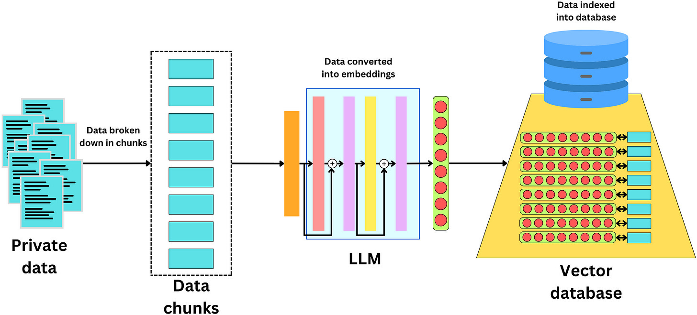
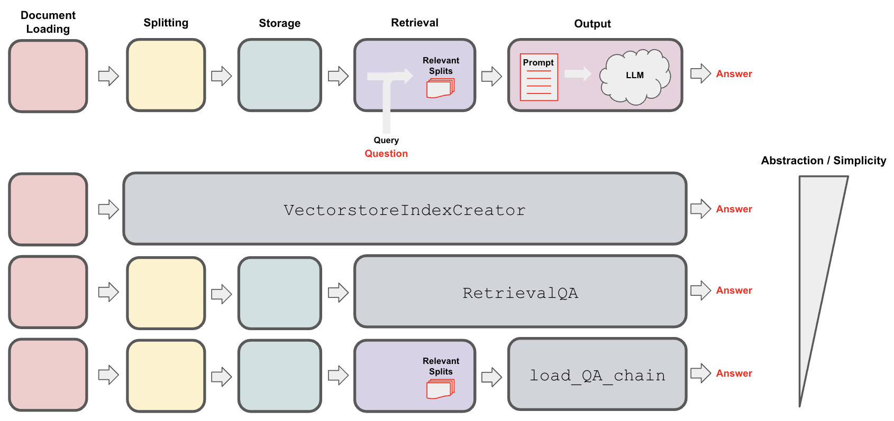

## Introduction

This project provides an API for custom text search functionality for large text documents, integrating with the LangChain library. 
It aims to provide efficient and relevant text retrieval for specific use cases.

## Installation and Setup

1. Clone the repository
2. Install the required packages: `pip install -r requirements.txt`
3. Place your text file in the desired location

## Usage

The main code is encapsulated in the TextSearch class, which provides methods to load documents, split text, store chunks, and retrieve chunks. A separate function run_query is used to execute a query and print the result.

## Running the Script
Set your OpenAI API key: Make sure to set your OpenAI API key in the environment or modify the code accordingly to include it.

Prepare the Transcript: Place your transcript file in the project directory and name it 1_transcript.txt.

Run the Script: You can run the script from the command line:

`uvicorn src.main:app --reload`

`uvicorn` is the ASGI server used to run FastAPI applications.

`src.main:app` tells uvicorn where to find the FastAPI application instance (app) within your project (in the main module under the src directory).

`--reload` is an optional argument that enables auto-reloading of the server when code changes are detected. This is particularly useful during development, as it allows for changes to take effect without manually restarting the server.
vbnet

## Theoretical Background

A large language model (LLM) is a type of machine learning model that can perform a variety of natural language processing (NLP) tasks, including generating and classifying text, answering questions in a conversational manner and translating text from one language to another.

BUT They only know what they learned during training. So how do we get them to use private data?  

The Answer is to Convert all private data into embeddings stored in a vector database.

### Text Search and Retrieval

The project utilizes a state-of-the-art text search and retrieval mechanism. It is based on the following key components:

#### Tokenization
Tokenization is the process of dividing text into smaller units, called tokens. In our implementation, we use a specific tokenization method to break down the text into chunks.

#### Embedding
We use OpenAI Embeddings to represent text in a numerical form, allowing for similarity comparisons and retrievals.

#### Retrieval
Based on the query, the most relevant chunks are retrieved and processed to form the final response.

For a more detailed explanation, refer to [QA Langchain Documentation](https://python.langchain.com/docs/use_cases/question_answering/).
